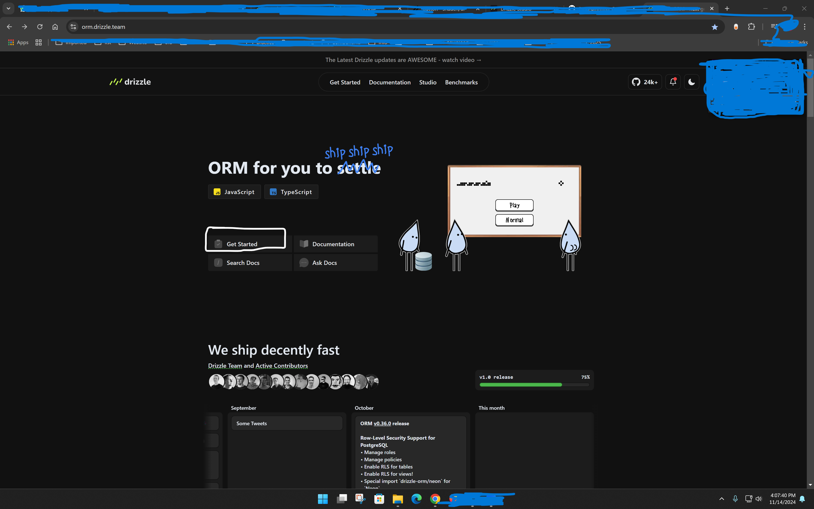
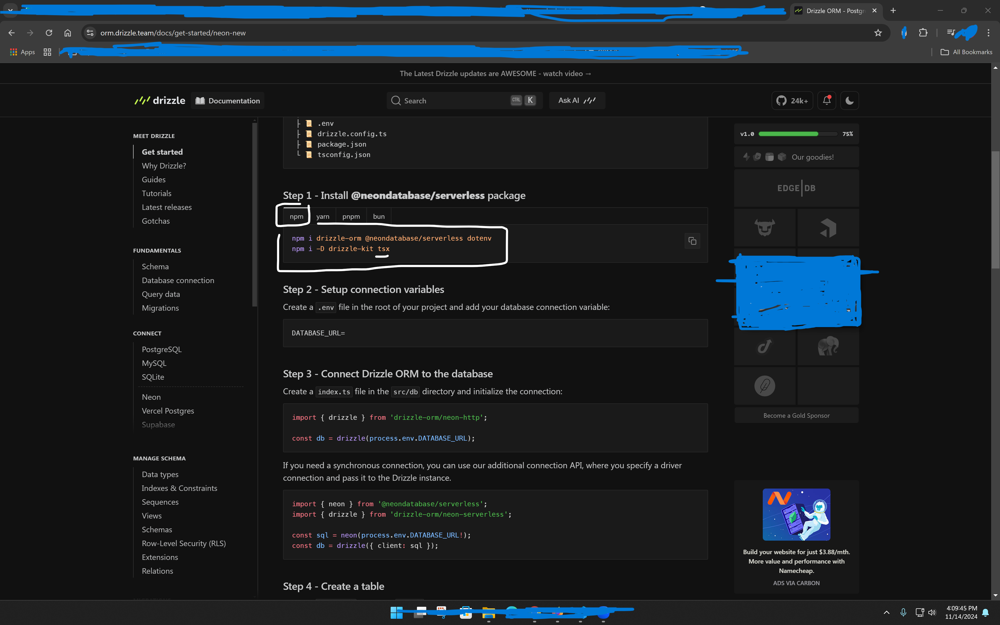

https://orm.drizzle.team/
---

## Project Overview and Setup

Here’s what we’ll do:
1. Set up a Neon database connection.
2. Define the database structure (schema).
3. Use Drizzle ORM to interact with the database.
4. Seed and query the database with basic CRUD operations.

### Project Structure

Your project should look like this:

```
📦 <project root>
 ├ 📂 drizzle         # Contains migration files and snapshots
 ├ 📂 src
 │   ├ 📂 db
 │   │  └ 📜 schema.js  # Database schema file
 │   └ 📜 index.js      # File for main database interactions
 ├ 📜 .env.local       # Contains sensitive environment variables
 ├ 📜 drizzle.config.js # Configuration file for Drizzle Kit
 ├ 📜 package.json
```

---

### Step 1: Install Required Packages

Run these commands in your project root:

```bash
npm i drizzle-orm @neondatabase/serverless dotenv
npm i -D drizzle-kit
```

**Explanation of Packages**:
- **`drizzle-orm`**: Helps us interact with the database.
- **`@neondatabase/serverless`**: Connects Drizzle to Neon.
- **`dotenv`**: Manages environment variables securely.

---

### Step 2: Set Up Environment Variables

Create a `.env.local` file in your project root. Add your Neon database connection URL:

```plaintext
DATABASE_URL=your_neon_database_url
```

> ⚠️ **Replace `your_neon_database_url`** with your actual Neon database connection link.

---

### Step 3: Connect Drizzle ORM to Neon

In `src/db`, create a file called `db.js` to handle the connection to Drizzle and Neon:

```javascript
// src/db/db.js
import { drizzle } from 'drizzle-orm/neon-http';
import dotenv from 'dotenv';

dotenv.config(); // Loads environment variables

// Initialize Drizzle connection
const db = drizzle(process.env.DATABASE_URL);

export default db;
```

---

### Step 4: Define the Database Schema

Define tables and columns for Drizzle to use with Neon.

1. In `src/db`, create a file called `schema.js`.
2. Add the following code to create a simple `users` table:

```javascript
// src/db/schema.js
import { integer, pgTable, varchar } from 'drizzle-orm/pg-core';

// Define "users" table
export const usersTable = pgTable('users', {
  id: integer().primaryKey().generatedAlwaysAsIdentity(),
  name: varchar({ length: 255 }).notNull(),
  age: integer().notNull(),
  email: varchar({ length: 255 }).notNull().unique(),
});
```

---

### Step 5: Configure Drizzle Kit

Drizzle Kit helps manage migrations and other database tasks.

1. In your project root, create a file named `drizzle.config.js`.
2. Add the following content:

```javascript
// drizzle.config.js
import 'dotenv/config';
import { defineConfig } from 'drizzle-kit';

export default defineConfig({
  out: './drizzle',
  schema: './src/db/schema.js',
  dialect: 'postgresql',
  dbCredentials: {
    url: process.env.DATABASE_URL,
  },
});
```

This configuration points Drizzle to our schema file and sets up the Neon connection.

---

### Step 6: Applying Changes to the Database

To create tables and apply changes to the Neon database, use Drizzle Kit's `push` command:

```bash
npx drizzle-kit push
```

> **Tip**: This directly updates the database with the schema you defined.

Alternatively, you can:
1. **Generate migration files**: `npx drizzle-kit generate`
2. **Apply migrations manually**: `npx drizzle-kit migrate`

---

### Step 7: Seed and Query the Database

Now, let’s write basic code to interact with the database.

1. In `src`, create an `index.js` file.
2. Add the following code to create, read, update, and delete users in the `users` table:

```javascript
// src/index.js
import 'dotenv/config';
import { drizzle } from 'drizzle-orm/neon-http';
import { usersTable } from './db/schema';

const db = drizzle(process.env.DATABASE_URL);

async function main() {
  // Create a new user
  const newUser = { name: 'John', age: 30, email: 'john@example.com' };
  await db.insert(usersTable).values(newUser);
  console.log('New user created!');

  // Read all users
  const users = await db.select().from(usersTable);
  console.log('Getting all users:', users);

  // Update a user's age
  await db.update(usersTable).set({ age: 31 }).where(usersTable.email.eq(newUser.email));
  console.log('User updated!');

  // Delete a user
  await db.delete(usersTable).where(usersTable.email.eq(newUser.email));
  console.log('User deleted!');
}

main();
```

This code performs basic CRUD operations:
- **Create** a new user.
- **Read** all users.
- **Update** an existing user.
- **Delete** the user by email.

---

### Step 8: Run the `index.js` File

To run this JavaScript file:

```bash
node src/index.js
```

---

### Tips for TypeScript Projects

If you ever switch to TypeScript, replace `.js` files with `.ts`, and add `tsx` to run TypeScript files with commands like `npx tsx src/index.ts`. 

Let me know if you need further clarification on any of these steps!